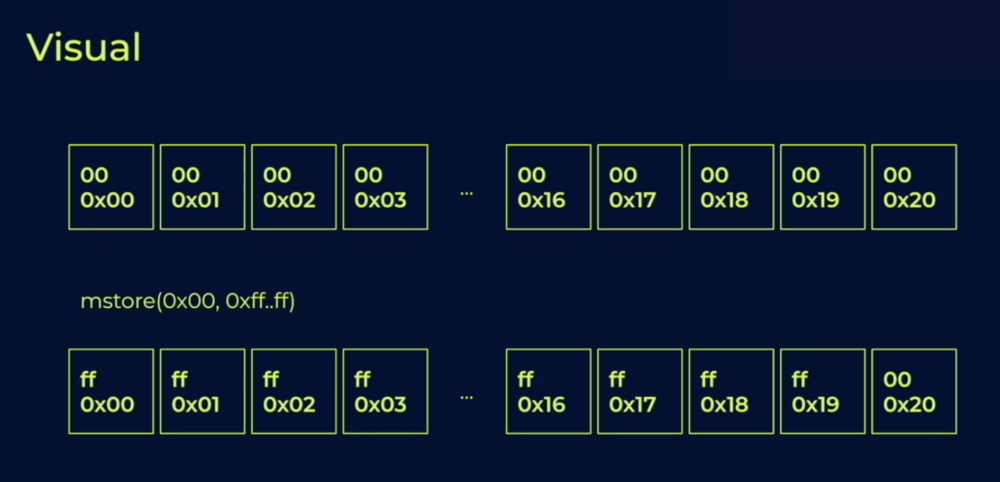
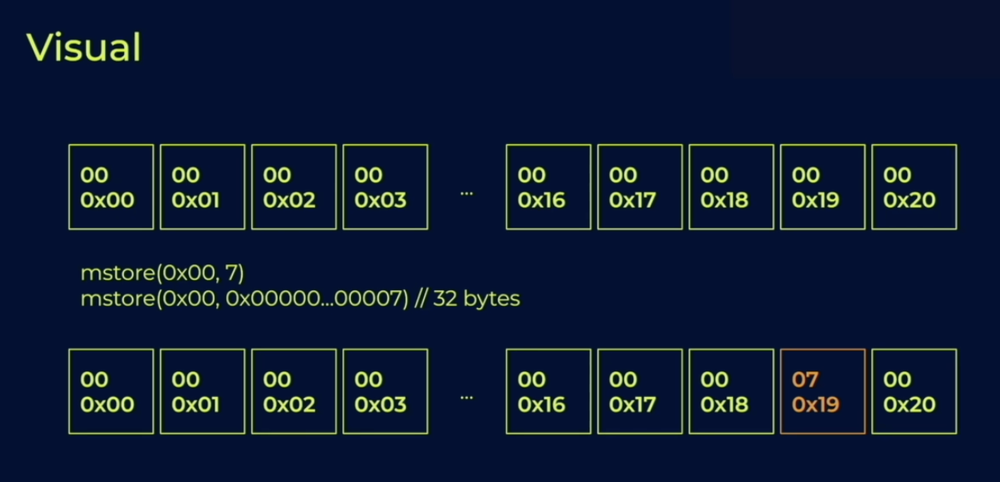
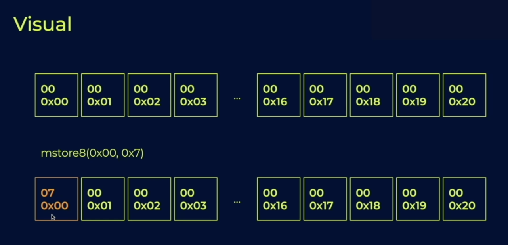

# Section 2 Notes

## Memory Operations
### Memory is a prerequisite
- You need memory to do the following:
  - Return values to external calls (when an external contract calls your contract)
  - Set the function arguments for external calls (when you want to set the function arguments to make an external call to another contract)
  - Get values from external calls (when you want to get those values back)
  - Revert with an error string
  - Log messages
  - Create other smart contracts
  - Use the `keccak256` hash function
### Overview
- Equivalent to the heap in other languages
  - But there is no garbage collector or `free`
  - Solidity memory is laid out in 32 byte sequences
  - Adjustible by byte rather than in increments of 32
- Only four instructions: `mload`, `mstore`, `mstore8`, `msize`
- In pure Yul programs, memory is easy to use. (just an array)
  - But in mixed Solidity/Yul programs, Solidity expects memory to be used in a specific manner
- **Important** You are charged gas for each memory access, _and_ for how far into the memory array you accessed
  - Memory is relatively cheap compared to storage, but the further out you access memory on that array, the more you be charged gas
  - Starts to become quadratic
  - This is to disincentivize users from abusing the memory in Ethereum nodes
- Ex: `mload (0xffffffffffffffff)` will run out of gas
  - Using a hash function to `mstore` like storage does is a bad idea
- `mstore(p, v)` stores value `v` in slot `p` (just like `sload`)
- `mload(p)` retrieves 32 bytes from slot `p` `[p..0x20]`
- `mstore(p, v)` and `mload(p)` can only read values in 32 byte increments 
- `mstore8(p, v)` like `mstore` but for 1 byte
- `msize()` largest accessed memory index in that transaction

- This would behave the same way you would expect it to in storage
  - If you `mstore` into slot 0 (32 bytes into `ff`), then you're going to see `ff` stored inside of each of the byte slots 
  - Byte is the smallest unit of memory, so doing `mstore(0x01)` won't shift you forward 32 bytes; it's only going to shift you forward 1 byte

- In this example the 00 slot is not written to, but it still writes 32 bytes and brings you up to the 0x20 (32 in decimal)
- In the first visual example, 0x20 would not be written to because 0x00 is equivalent to zero and 0x19 is equivalent to 31

- In this example, decimal 7 is the same as hexadecimal 7
- In this case, you are still going to be implicitly having a bunch of zeroes in front of the 7
  - Still write to slots leading up to the 32nd byte and 7 will be stored in the slot at the end

- If you used `mstore8` instead, then only the 0th slot will be written to and the 7 would be put into slot 0
  - The other bytes in front of it would be untouched
## How Solidity Uses Memory
## Dangers of Memory Misuse
## Return, Require, Tuples, and Keccak256
## Logs and Events