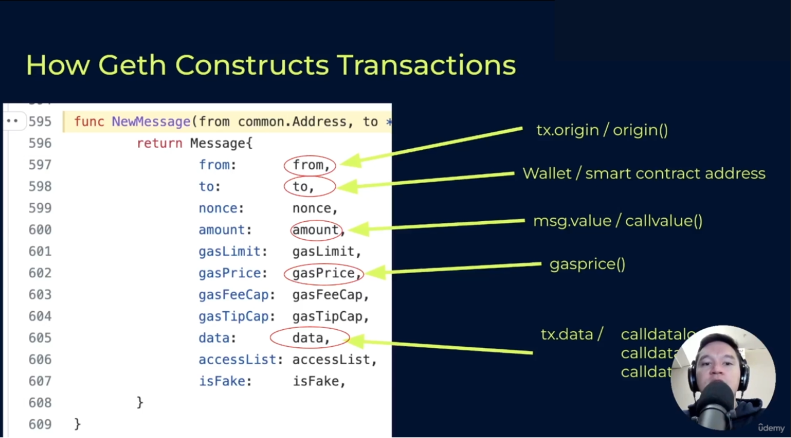
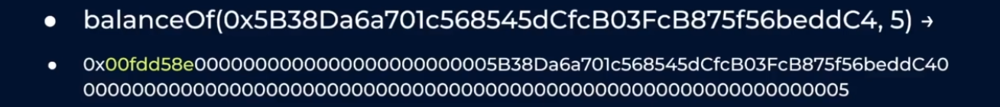

# Section 3 Notes

## Calldata

- This is the last part of the Ethereum transaction that you can directly access from inside the smart contract
  - This is a snippet from the geth client that constructs an Ethereum transcation
    - `from` is `tx.origin` or `origin()` in Yul,
    - `to` is the wallet or smart contract that is receiving the transaction,
    - `amount` is `msg.value` or `callvalue()`,
    - `gasPrice` is `gasprice()`,
    - and `data` is `tx.data`
- In Solidity, you'd access the transaction.data as `tx.data`
  - But in Yul, there isn't a 1 to 1 correspondence with that
- `tx.data` can be arbitrary
  - Only constrained by gas cost
  - The longer the `tx.data` arrays, the more gas the sender pays
### Convention
- Solidity's dominance has enforced a convention on how `tx.data` is used
- When sending to a wallet, you don't put any data in unless you are trying to send that person a message (hackers have used this field for taunts)
- When dealing with Solidity, it reserves the first four bytes inside of the `tx.data` array to specify the function selector; everything after that is the abi encoded function arguments
- Solidity expects the bytes after the function selector to always be a multiple of 32 in length, but this is convention
  - If you send more bytes, Solidity will ignore them
  - In Yul, smart contracts can be programmed to respond to arbitrary length `tx.data` in an arbitrary manner or you can program it to completely ignore `tx.data`
### Overview
- Function selectors are the first four bytes of the `keccak256` of the function signature
  - If you had something like `balanceOf(address _address)` like an ERC20 does, then the function signature would just be the function with the arguments as the data types and no variable names

- In this case, the first four bytes are the `keccak256` seen above, and the `tx.data` would be what we have below:

- The first four bytes are the function selector, and then concatenated to it is the first argument
  - Because addresses have 20 bytes, but abi encoded data is always a multiple of 32 bytes, the address is left padded with zeroes

- Here's another example in which `balanceOf` is taking two arguments; one is an address and the next one is an id (may be an ERC1155)

- The function selector comes first, followed by the zero padded address, followed by the integer that comes at the end:

- It doesn't matter if the function argument was a `uint256`, a `uint128`, or a `uint8`: the abi encoded data for the function will **always** be 32 bytes 
### ABI specification
- Front-end apps know how to format the transaction based on the abi specification of the contract
- In Solidity, the function selector and 32 byte encoded arguments are created under the hood by interfaces (turning your function call into a concatenation of the function selector and the abi encoded arguments) or if you use `abi.encodeWithSignature("balanceOf(address)", 0x...)`
  - But in Yul, you have to be explicit
- In Yul, if you want to make an external call to another Solidity smart contract, you're going to have to implement this yourself
  - Yul doesn't have a notion of function selectors, interfaces, or abi encoding 
  - However, you're going to have to follow the convention if you want the receiving smart contract to interpret your function call correctly
## Calling other contracts
## Dynamic Length Arguments
## Transfer of value
## Receiving contract calls